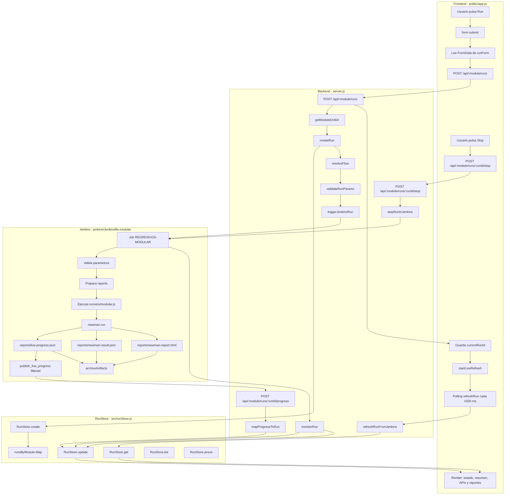
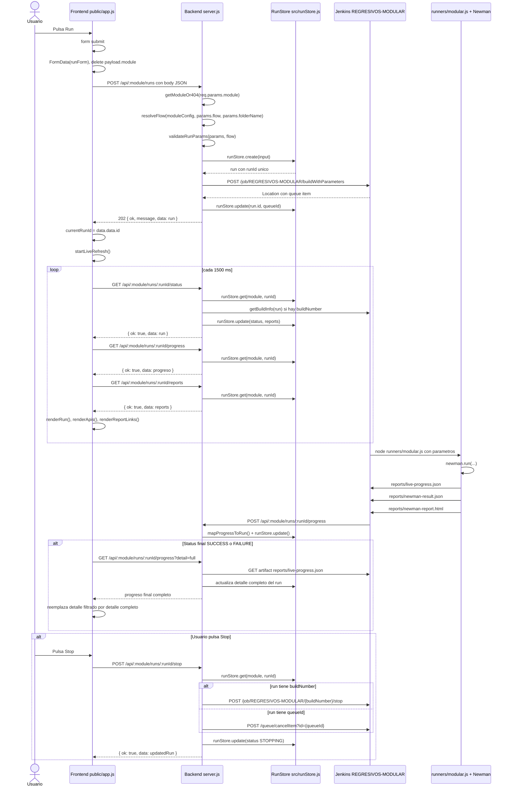

# Mapa tecnico del flujo de ejecucion modular

## A. Resumen ejecutivo

El dashboard permite lanzar regresiones modulares desde la interfaz web servida por `server.js`. El usuario selecciona modulo, flujo y parametros de ejecucion. La logica de `public/app.js` toma los valores del formulario `runForm` y llama `POST /api/:module/runs`.

El backend recibe la solicitud, valida el modulo y los parametros, resuelve el flujo seleccionado contra el folder Newman configurado en `src/modules.js`, crea un run temporal en `RunStore` y dispara un unico job Jenkins parametrizado mediante `triggerJenkinsRun()`.

El job Jenkins vigente es `REGRESIVOS-MODULAR`, definido por `REGRESIVOS_JOB_NAME`, y usa `jenkins/Jenkinsfile.modular`. El pipeline invoca `node runners/modular.js`, que ejecuta Newman contra la coleccion y environment compartidos, genera reportes y publica progreso al backend usando el endpoint dinamico:

```http
POST /api/:module/runs/:runId/progress
```

Durante la ejecucion, Jenkins publica un payload liviano en modo `filtered`. Al finalizar, el backend puede cargar el detalle completo desde el artifact final de Jenkins. El frontend guarda el `runId` devuelto por el backend y hace polling cada `1500 ms` contra status, progress y reports para renderizar estado, resumen, APIs visibles y links de reportes.

`RunStore` es memoria temporal en RAM. Si el backend se reinicia, se pierde el historial local de runs.

## B. Diagrama Mermaid - flowchart



## C. Diagrama Mermaid - sequenceDiagram



## D. Tabla de trazabilidad

| Paso | Archivo involucrado | Funcion ejecutada | Endpoint | Entrada | Salida | Estado generado |
|---|---|---|---|---|---|---|
| Carga inicial del dashboard | `public/app.js` | `initDashboard()` | `GET /api/modules`, `GET /api/:module/flows`, `GET /api/:module/runs` | Sin body | Modulos, flujos y ultimo run | Sin cambio de estado |
| Selector de modulo | `public/app.js` | `moduleSelect.addEventListener('change')` | `GET /api/:module/flows` | `moduleId` | Lista de flows | Limpia run activo en UI |
| Selector de flujos | `public/app.js` | `loadFlows(moduleId)` | `GET /api/:module/flows` | `moduleId` | Lista `flows` | Sin cambio de estado |
| Click Run | `public/app.js` | `form.addEventListener('submit')` | N/A evento UI | Campos de `runForm` | `payload` sin `module`; `module` va en URL | UI pasa a `QUEUED` |
| Crear run | `public/app.js` | handler submit | `POST /api/:module/runs` | `flow`, `environment`, `platform`, `serviceType`, `device`, `region`, `endpointType`, `userFlow` | `{ ok, message, data: run }` | `currentRunId = data.data.id` |
| Recibir run | `server.js` | `app.post('/api/:module/runs')` | `POST /api/:module/runs` | `req.params.module`, `req.body` | `202` con `data: run` | Depende de `createRun()` |
| Validar modulo | `server.js` | `getModuleOr404(moduleId, res)` | Interno | `moduleId` | `moduleConfig` o 404 JSON | Sin cambio de estado |
| Resolver flujo | `src/modules.js` | `resolveFlow(module, requestedFlow, fallbackFolder)` | Interno | `params.flow`, `params.folderName` | Flow con `id`, `label`, `folderName` | Sin cambio de estado |
| Crear estado inicial | `server.js` | `createRun(moduleConfig, params)` | Interno | `moduleConfig`, `params` | `queuedRun` | `QUEUED` |
| Guardar run | `src/runStore.js` | `RunStore.create(input)` | Interno | Campos del run inicial | Run guardado en `runsByModule` | `QUEUED`, `startedAt`, `updatedAt` |
| Generar runId | `server.js` | `createRunId(moduleId)` | Interno | `moduleId` | `module-timestamp-uuid` | Run identificable por `runId` |
| Disparar Jenkins | `server.js` | `triggerJenkinsRun(moduleConfig, run)` | `POST {JENKINS_BASE_URL}/job/{jobName}/buildWithParameters` | `URLSearchParams` con parametros Jenkins | Header `location` de queue | Backend obtiene `queueId` |
| Actualizar queue | `server.js`, `src/runStore.js` | `runStore.update(run.module, run.id, { queueId })` | Interno | `queueId` | Run actualizado | Sigue `QUEUED` |
| Esperar buildNumber | `server.js` | `monitorRun()` -> `waitForBuildNumber()` | `GET /queue/item/{queueId}/api/json` | `queueId` | `buildNumber`, `buildUrl` | `RUNNING` cuando Jenkins asigna build |
| Ejecutar pipeline | `jenkins/Jenkinsfile.modular` | stages del pipeline | N/A | Parametros del job | Ejecuta `runners/modular.js` | Jenkins build en progreso |
| Ejecutar Newman | `runners/modular.js` | `run()` -> `newman.run(...)` | N/A | CLI args y archivos Postman | Reportes JSON/HTML/progreso | `RUNNING`, luego `SUCCESS` o `FAILURE` |
| Publicar progreso live | `jenkins/Jenkinsfile.modular` | `publish_live_progress()` | `POST /api/:module/runs/:runId/progress` | Payload `filtered` desde `reports/live-progress.json` | Backend responde `202` | Backend actualiza RunStore |
| Mapear progreso | `src/progressMapper.js` | `mapProgressToRun(progress, run)` | `POST /api/:module/runs/:runId/progress` | JSON de progreso | Patch para run | Status desde `progress.execution.status` |
| Polling de status | `public/app.js` | `refreshRun()` | `GET /api/:module/runs/:runId/status` | `currentModule`, `currentRunId` | `{ ok, data: run }` | UI refleja estado actual |
| Polling de progress | `public/app.js` | `refreshRun()` | `GET /api/:module/runs/:runId/progress` | `currentModule`, `currentRunId` | Summary, APIs y steps | UI renderiza APIs visibles |
| Carga final full | `public/app.js`, `server.js` | `refreshRun()` + artifact sync | `GET /api/:module/runs/:runId/progress?detail=full` | Run final con `buildNumber` | Detalle completo desde artifact Jenkins | UI reemplaza detalle filtrado |
| Polling de reports | `public/app.js` | `refreshRun()` | `GET /api/:module/runs/:runId/reports` | `currentModule`, `currentRunId` | `reports` con links Jenkins/Newman | UI renderiza links |
| Render visual | `public/app.js` | `renderRun()`, `renderApis()`, `renderReportLinks()` | N/A | `lastRun`, `lastReports` | DOM actualizado | Botones actualizados |
| Stop | `public/app.js` | `stopButton.addEventListener('click')` | `POST /api/:module/runs/:runId/stop` | `currentModule`, `currentRunId` | `{ ok, data: updatedRun }` | `STOPPING` |
| Detener Jenkins | `server.js` | `stopRunInJenkins()` | Jenkins `/stop` o `/queue/cancelItem` | `buildNumber` o `queueId` | Jenkins acepta stop/cancel | Luego `STOPPED` si Jenkins aborta |

## E. Puntos criticos a validar

### Variables de entorno necesarias

```env
PORT=3000
JENKINS_BASE_URL=http://localhost:8080
JENKINS_USER=admin
JENKINS_API_TOKEN=REEMPLAZAR_CON_API_TOKEN_REAL
JENKINS_POLL_INTERVAL_MS=1500
JSON_BODY_LIMIT=75mb
JENKINS_DASHBOARD_BASE_URL=http://host.docker.internal:3000
REGRESIVOS_JOB_NAME=REGRESIVOS-MODULAR
POSTMAN_COLLECTION_FILE=collections/REGRESIVOS.postman_collection.json
POSTMAN_ENVIRONMENT_FILE=environments/PRE-UAT-PROD-CLAROVIDEO.postman_environment.json
RUN_STORE_LIMIT_PER_MODULE=50
```

`validateRequiredEnv()` en `server.js` exige `JENKINS_BASE_URL`, `JENKINS_USER` y `JENKINS_API_TOKEN`.

### Modulos y flows activos

Los modulos vigentes estan definidos en `src/modules.js`.

```text
ply:
  - Getmedia
  - Assets
  - Tracking - Bookmark

usr:
  - Perfiles
  - Favorited
  - ControlPin
  - Reminder
```

Ambos modulos usan el mismo job Jenkins parametrizado y la misma coleccion Postman compartida.

### dashboardBaseUrl y publicacion de live progress

`dashboardBaseUrl` es la URL base del backend vista desde Jenkins. Jenkins la usa para publicar progreso en vivo hacia el backend:

```http
POST /api/:module/runs/:runId/progress
```

El valor recomendado para Jenkins local en Docker sobre Windows es:

```text
http://host.docker.internal:3000
```

Validar conectividad desde el mismo agente donde corre Jenkins:

```bash
curl -i http://host.docker.internal:3000/api/modules
```

La respuesta esperada es HTTP `200` con JSON.

### Nombre del job Jenkins

El job activo se resuelve desde `REGRESIVOS_JOB_NAME` y por defecto es:

```text
REGRESIVOS-MODULAR
```

En Jenkins debe existir un unico Pipeline job apuntando a:

```text
jenkins/Jenkinsfile.modular
```

### Parametros del job Jenkins

El backend envia estos parametros al job:

```text
module
runId
collectionFile
environmentFile
flow
folderName
environment
platform
serviceType
device
region
endpointType
userFlow
dashboardBaseUrl
liveProgressMode
liveProgressTimeoutMs
```

`folderName` debe coincidir con el folder Newman dentro de la coleccion.

### Rutas del backend

```http
GET  /
GET  /api/modules
GET  /api/:module/flows
GET  /api/:module/runs
POST /api/:module/runs
GET  /api/:module/runs/:runId
GET  /api/:module/runs/:runId/status
GET  /api/:module/runs/:runId/progress
POST /api/:module/runs/:runId/progress
GET  /api/:module/runs/:runId/reports
POST /api/:module/runs/:runId/stop
```

### Estados activos y finales

Estados finales:

```text
SUCCESS
FAILURE
ABORTED
STOPPED
CLEARED
UNKNOWN
```

Estados activos comunes:

```text
QUEUED
RUNNING
BUILDING
STOPPING
```

`STOPPING` se mantiene activo hasta que Jenkins confirme el cierre del build o de la cola.

### Progreso live y detalle final

Durante `RUNNING`, Jenkins publica payload liviano en modo:

```text
LIVE_PROGRESS_MODE=filtered
```

El payload live conserva la URL completa de cada API y filtra headers sensibles. No envia response body completo en cada publicacion.

Cuando el run queda en `SUCCESS` o `FAILURE`, el frontend solicita:

```http
GET /api/:module/runs/:runId/progress?detail=full
```

El backend lee el artifact final `reports/live-progress.json` de Jenkins y expande el detalle completo de cada API.

### Reportes Newman

Artifacts generados:

```text
reports/live-progress.json
reports/newman-result.json
reports/newman-report.html
```

Jenkins los publica como artifacts del build para consulta desde el dashboard.

### Permisos y dependencias necesarias en Jenkins

El agente Jenkins necesita:

- `node` y `npm` disponibles.
- Acceso al repositorio Git.
- Permiso para archivar artifacts.
- Acceso de red al backend usando `dashboardBaseUrl`.

El backend necesita credenciales Jenkins API con permisos para:

- disparar `buildWithParameters`;
- consultar queue item;
- consultar build;
- detener build;
- cancelar item en cola.

### Limitacion de memoria temporal

`RunStore` usa un `Map` en RAM:

```js
this.runsByModule = new Map();
```

Cada modulo conserva hasta `RUN_STORE_LIMIT_PER_MODULE` runs. Si se reinicia el backend, se pierde el historial local.

## RunStore / memoria temporal en detalle

`RunStore` esta definido en `src/runStore.js`. No usa base de datos ni archivos para persistir runs.

Cada run guarda:

```js
{
  id,
  module,
  collection,
  flow,
  newmanFolder,
  status,
  queueId,
  buildNumber,
  buildUrl,
  jobName,
  command,
  config,
  executionSteps,
  qaConsole,
  summary,
  apiExecutions,
  reports,
  result,
  startedAt,
  finishedAt,
  updatedAt,
  lastError
}
```

Metodos principales:

- `create(input)`: crea el run, lo guarda por modulo y ejecuta `prune(moduleId)`.
- `list(moduleId)`: devuelve runs del modulo ordenados por `startedAt` descendente.
- `get(moduleId, runId)`: devuelve un run especifico o `null`.
- `update(moduleId, runId, updater)`: mezcla un patch sobre el run y actualiza `updatedAt`.
- `findLatest(moduleId)`: devuelve el run mas reciente.
- `findLatestActive(moduleId)`: devuelve el run activo mas reciente.
- `findByBuildNumber(moduleId, buildNumber)`: busca por `buildNumber`.
- `clearModule(moduleId)`: vacia los runs de un modulo.
- `prune(moduleId)`: recorta la lista a `limitPerModule`.

## Consulta de status

Cuando el frontend llama:

```http
GET /api/:module/runs/:runId/status
```

ocurre este flujo:

1. El handler de `server.js` recibe `module` y `runId`.
2. `getRunOr404()` valida modulo y busca el run en `RunStore`.
3. Si el run existe, `refreshRunFromJenkins(run)` consulta Jenkins cuando corresponde.
4. El backend normaliza el estado con `normalizeStatus()` y `getRunStatusFromJenkins()`.
5. `RunStore` se actualiza con estado, reportes, timestamps y links.
6. El backend responde `{ ok: true, data: run }`.
7. El frontend combina status y progress en `mergeRunProgress()`.
8. `renderRun()` actualiza la UI.

## Stop / cancelacion

Cuando el usuario pulsa Stop:

1. `public/app.js` valida que exista `currentModule`, `currentRunId` y un run no final.
2. Cambia la UI a `STOPPING`.
3. Llama:

```http
POST /api/:module/runs/:runId/stop
```

4. El backend busca el run en `RunStore`.
5. Si el run tiene `buildNumber`, solicita detener el build en Jenkins.
6. Si el run aun solo tiene `queueId`, cancela el item de cola.
7. `RunStore` queda con `status: 'STOPPING'` y `cancellationRequested: true`.
8. El polling posterior refleja el estado final cuando Jenkins termina de abortar o detener.

## Explicacion para entregar al jefe

El flujo funciona como una cadena coordinada entre pantalla, backend, memoria temporal y Jenkins.

El frontend permite seleccionar modulo, flujo y parametros de ejecucion. Cuando el usuario pulsa Run, la pantalla no ejecuta Newman directamente. Envia una solicitud al backend para crear una nueva ejecucion.

El backend valida el modulo, resuelve el flujo al folder Newman correspondiente y crea un run temporal en memoria. Ese run recibe un `runId` unico y queda guardado en `RunStore`.

Con el run creado, el backend dispara el job Jenkins unico `REGRESIVOS-MODULAR`. Jenkins hace checkout del proyecto, prepara el workspace, ejecuta `runners/modular.js` y ese runner usa Newman para correr la coleccion Postman con el folder recibido por parametro.

Mientras Jenkins ejecuta Newman, publica progreso liviano al backend. El dashboard consulta periodicamente el backend usando el `runId` y actualiza estado, contadores, APIs visibles y links de reportes.

Al finalizar, el dashboard pide una carga final completa. El backend toma el artifact final de Jenkins y reemplaza el detalle liviano por el detalle completo de la ejecucion.

`RunStore` es memoria temporal. Relaciona el `runId` de pantalla con el `queueId`, `buildNumber` y `buildUrl` de Jenkins, pero no persiste informacion si el backend se reinicia.

Si el usuario pulsa Stop, el backend decide si debe cancelar un item de cola o detener un build en Jenkins. Como Newman corre dentro del job Jenkins, detener el build corta la ejecucion del runner.
