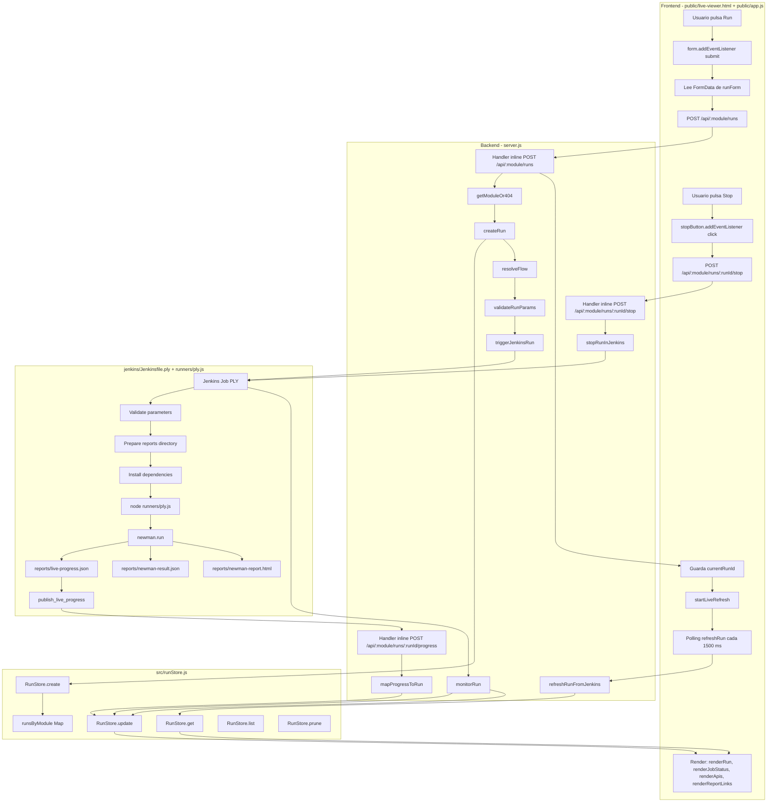
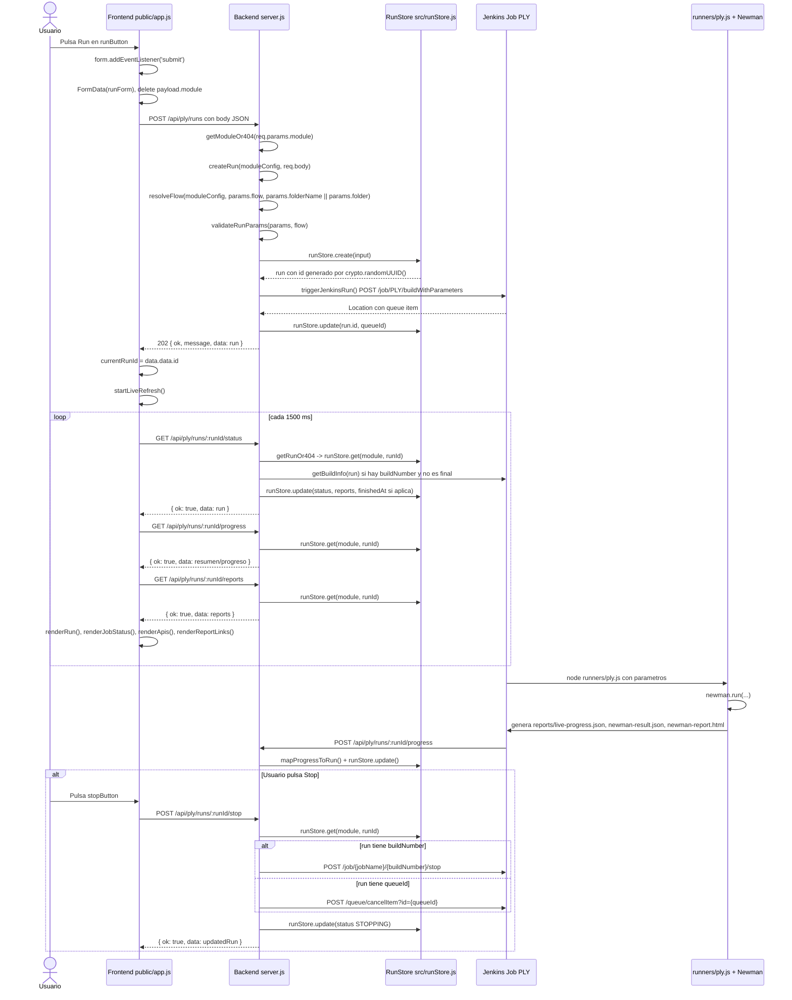

# Mapa tecnico del flujo de ejecucion modular

## A. Resumen ejecutivo

El dashboard permite lanzar una regresion modular desde `public/live-viewer.html`. El usuario selecciona modulo, flujo y parametros de ejecucion. La logica de `public/app.js` toma esos valores del formulario `runForm` y llama `POST /api/:module/runs`.

El backend en `server.js` recibe la solicitud, valida el modulo y los parametros, resuelve el flujo seleccionado contra el folder Newman configurado en `src/modules.js`, crea un run temporal en `RunStore` y dispara Jenkins mediante `triggerJenkinsRun()`. Jenkins ejecuta el job configurado para el modulo, en PLY el job es `PLY`, usando `jenkins/Jenkinsfile.ply`. El pipeline invoca `node runners/ply.js`, que ejecuta Newman contra la coleccion y environment compartidos, genera reportes y publica progreso al backend.

El frontend guarda el `runId` devuelto por el backend y arranca polling cada `1500 ms`. Consulta status, progress y reports del run para renderizar estado, resumen, APIs visibles y links de reportes. La memoria `RunStore` es temporal: vive en RAM y se pierde al reiniciar el backend.

## B. Diagrama Mermaid - flowchart



## C. Diagrama Mermaid - sequenceDiagram



## D. Tabla de trazabilidad

| Fase | Archivo involucrado | Funcion ejecutada | Endpoint | Entrada | Salida | Estado generado |
|---|---|---|---|---|---|---|
| Carga inicial del dashboard | `public/app.js` | `initDashboard()` | `GET /api/modules`, `GET /api/:module/flows`, `GET /api/:module/runs` | Sin body. Usa `currentModule = 'ply'` | Modulos, flujos y ultimo run si existe | Sin cambio de estado |
| Selector de flujos | `public/app.js` | `loadFlows(moduleId)` | `GET /api/${moduleId}/flows` | `moduleId` desde `moduleSelect` | Lista `flows` | Sin cambio de estado |
| Click Run | `public/live-viewer.html`, `public/app.js` | `form.addEventListener('submit', ...)` | N/A evento UI | Campos de `runForm`: `module`, `flow`, `environment`, `platform`, `serviceType`, `device`, `region`, `endpointType` | `payload` sin `module`; `module` va en URL | UI pasa a `QUEUED` con `setRunningUi(true, 'QUEUED')` |
| Crear run | `public/app.js` | handler submit | `POST /api/:module/runs` | Body JSON: `flow`, `environment`, `platform`, `serviceType`, `device`, `region`, `endpointType` | Espera `{ ok, message, data: run }` | `currentRunId = data.data.id` |
| Recibir run | `server.js` | Handler inline `app.post('/api/:module/runs', ...)` | `POST /api/:module/runs` | `req.params.module`, `req.body` | `202` con `data: run` | Depende de `createRun()` |
| Validar modulo | `server.js` | `getModuleOr404(moduleId, res)` | Interno | `moduleId` | `moduleConfig` o 404 JSON | Sin cambio de estado |
| Crear estado inicial | `server.js` | `createRun(moduleConfig, params)` | Interno | `moduleConfig`, `params` | `queuedRun` | `QUEUED` |
| Resolver flujo | `src/modules.js` | `resolveFlow(module, requestedFlow, fallbackFolder)` | Interno | `params.flow`, fallback `params.folderName || params.folder` | Objeto flow con `id`, `label`, `folderName` | Sin cambio de estado |
| Validar parametros | `server.js` | `validateRunParams(params, flow)` | Interno | `environment`, `platform`, `device`, `region`, `endpointType`, `flow` | Error 400 si falta alguno | Sin cambio de estado |
| Guardar run | `src/runStore.js` | `RunStore.create(input)` | Interno | Campos del run inicial | Run guardado en `runsByModule` | `QUEUED`, `startedAt`, `updatedAt` |
| Generar runId | `src/runStore.js` | `crypto.randomUUID()` dentro de `create()` | Interno | Si `input.id` no existe | UUID en `run.id` | Run identificable por `runId` |
| Disparar Jenkins | `server.js` | `triggerJenkinsRun(moduleConfig, run)` | `POST {JENKINS_BASE_URL}/job/{jobName}/buildWithParameters` | `URLSearchParams` con parametros Jenkins | Headers con `location` de queue | Backend obtiene `queueId` |
| Actualizar queue | `server.js`, `src/runStore.js` | `runStore.update(run.module, run.id, { queueId })` | Interno | `queueId` extraido por `extractQueueIdFromLocation()` | Run actualizado | Sigue `QUEUED` |
| Esperar buildNumber | `server.js` | `monitorRun()` -> `waitForBuildNumber()` -> `getQueueInfo()` | `GET /queue/item/{queueId}/api/json` en Jenkins | `queueId` | `buildNumber`, `buildUrl` | `RUNNING` cuando Jenkins asigna build |
| Jenkins pipeline | `jenkins/Jenkinsfile.ply` | Pipeline `stages` | N/A | Parametros del job | Ejecuta stages | Jenkins BUILD en progreso |
| Ejecutar Newman | `jenkins/Jenkinsfile.ply` | Shell `node runners/ply.js ...` | N/A | `runId`, `collectionFile`, `environmentFile`, `flow`, `folderName`, ambiente/plataforma/etc. | Proceso Node/Newman | `RUNNING` en `live-progress.json` |
| Newman runner | `runners/ply.js` | `run()` -> `newman.run(...)` | N/A | CLI args y archivos Postman | Reportes JSON/HTML/progreso | `SUCCESS` o `FAILURE` en `finish()` |
| Publicar progreso | `jenkins/Jenkinsfile.ply` | `publish_live_progress()` | `POST /api/ply/runs/${PLY_RUN_ID}/progress` | `reports/live-progress.json` | Backend responde JSON | Backend actualiza RunStore |
| Mapear progreso | `server.js`, `src/progressMapper.js` | `mapProgressToRun(progress, run)` | `POST /api/:module/runs/:runId/progress` | JSON de progreso | Patch para run | Status desde `progress.execution.status` |
| Polling de status | `public/app.js` | `startLiveRefresh()` -> `refreshRun()` | `GET /api/:module/runs/:runId/status` | `currentModule`, `currentRunId` | `{ ok, data: run }` | UI refleja estado actual |
| Polling de progress | `public/app.js` | `refreshRun()` | `GET /api/:module/runs/:runId/progress` | `currentModule`, `currentRunId` | Summary, apiExecutions, steps | UI renderiza APIs visibles |
| Polling de reports | `public/app.js` | `refreshRun()` | `GET /api/:module/runs/:runId/reports` | `currentModule`, `currentRunId` | `reports` con links Jenkins | UI renderiza links |
| Render visual | `public/app.js` | `renderRun()`, `renderJobStatus()`, `renderApis()`, `renderReportLinks()` | N/A | `lastRun`, `lastReports` | DOM actualizado | Botones actualizados por `setRunningUi()` |
| Stop | `public/app.js` | `stopButton.addEventListener('click', ...)` | `POST /api/:module/runs/:runId/stop` | `currentModule`, `currentRunId` | `{ ok, data: updatedRun }` | `STOPPING` |
| Stop backend | `server.js` | Handler inline `app.post('/api/:module/runs/:runId/stop', ...)` | `POST /api/:module/runs/:runId/stop` | `req.params.module`, `req.params.runId` | JSON ok/error | `STOPPING` o error |
| Detener Jenkins | `server.js` | `stopRunInJenkins()` | Jenkins `/stop` o `/queue/cancelItem` | `buildNumber` o `queueId` | Jenkins acepta stop/cancel | Luego `STOPPED` si Jenkins queda `ABORTED/STOPPED` |

## E. Puntos criticos a validar

### Variables de entorno necesarias

Confirmadas en `.env.example`, `server.js` y `src/modules.js`:

```env
PORT=3000
JENKINS_BASE_URL=http://localhost:8080
JENKINS_USER=admin
JENKINS_API_TOKEN=REEMPLAZAR_CON_API_TOKEN_REAL
JENKINS_POLL_INTERVAL_MS=1500
JENKINS_DASHBOARD_BASE_URL=http://<IP_DE_TU_HOST>:3000
PLY_JOB_NAME=PLY
USR_JOB_NAME=USR
CMS_JOB_NAME=CMS
GPS_JOB_NAME=GPS
POSTMAN_COLLECTION_FILE=collections/REGRESIVOS.postman_collection.json
POSTMAN_ENVIRONMENT_FILE=environments/PRE-UAT-PROD-CLAROVIDEO.postman_environment.json
RUN_STORE_LIMIT_PER_MODULE=50
```

`validateRequiredEnv()` en `server.js` exige: `JENKINS_BASE_URL`, `JENKINS_USER`, `JENKINS_API_TOKEN`.

### dashboardBaseUrl y publicacion de live progress

Confirmado en `server.js`, `jenkins/Jenkinsfile.ply` y `.env.example`.

`dashboardBaseUrl` es la URL base del backend vista desde Jenkins. Jenkins la usa para publicar progreso en vivo hacia el backend con este endpoint:

```http
POST /api/ply/runs/{runId}/progress
```

En `jenkins/Jenkinsfile.ply`, la URL final se arma asi:

```text
${DASHBOARD_BASE_URL%/}/api/ply/runs/${PLY_RUN_ID}/progress
```

Por eso este valor no debe pensarse como "la URL que abre el usuario en el navegador", sino como "la URL que Jenkins puede alcanzar para hablar con el backend".

#### Orden real de resolucion

El orden confirmado por codigo es:

1. `params.dashboardBaseUrl`, si llega en el body de `POST /api/:module/runs`.
2. `process.env.JENKINS_DASHBOARD_BASE_URL`, si existe en `.env`.
3. `getDashboardBaseUrlForJenkins(PORT)`, si no existe la variable de entorno.
4. Fallback del `Jenkinsfile.ply` a `http://host.docker.internal:3000` si el parametro Jenkins `dashboardBaseUrl` llega vacio.

En `server.js`:

```js
const JENKINS_DASHBOARD_BASE_URL = process.env.JENKINS_DASHBOARD_BASE_URL || getDashboardBaseUrlForJenkins(PORT);
```

En `buildRunConfig()`:

```js
dashboardBaseUrl: params.dashboardBaseUrl || JENKINS_DASHBOARD_BASE_URL
```

En `triggerJenkinsRun()`:

```js
form.append('dashboardBaseUrl', config.dashboardBaseUrl);
```

#### Lo que no ocurre actualmente

Confirmado por busqueda en `public`, `server.js` y `jenkins/Jenkinsfile.ply`:

- El frontend no calcula `dashboardBaseUrl` con `window.location`.
- `public/app.js` no envia `dashboardBaseUrl` en el body actual.
- El backend es quien decide el valor que se envia a Jenkins.
- `host.docker.internal` no es siempre el valor usado por backend; solo aparece como default del parametro en `Jenkinsfile.ply` y como fallback automatico si `getDashboardBaseUrlForJenkins(PORT)` no encuentra una IP privada.

#### Calculo automatico del backend

`getDashboardBaseUrlForJenkins(port)` usa `os.networkInterfaces()` y busca direcciones IPv4 no internas.

La funcion intenta:

1. Ignorar interfaces cuyo nombre parezca `wsl`, `docker`, `virtual`, `hyper-v` o `vethernet`.
2. Elegir una IP privada de red local:
   - `192.168.x.x`
   - `10.x.x.x`
   - `172.16.x.x` a `172.31.x.x`
3. Si no encuentra una interfaz preferida, toma cualquier IP privada disponible.
4. Si no encuentra ninguna IP privada, devuelve:

```text
http://host.docker.internal:{PORT}
```

Ejemplo con `PORT=3000`:

```text
http://192.168.1.25:3000
```

o, si no detecta IP privada:

```text
http://host.docker.internal:3000
```

#### Valor recomendado segun ambiente

| Ambiente | Valor recomendado para `JENKINS_DASHBOARD_BASE_URL` | Motivo |
|---|---|---|
| Jenkins local en Docker | `http://host.docker.internal:3000` si Jenkins corre en Docker Desktop y resuelve ese host. Si no resuelve, usar `http://<IP_PRIVADA_DEL_HOST>:3000`. | Jenkins esta dentro de un contenedor y `localhost:3000` apuntaria al contenedor, no al backend del host. |
| Jenkins en servidor externo | `http://<HOST_O_IP_DEL_BACKEND>:3000` o la URL HTTPS corporativa si existe proxy. | Jenkins debe alcanzar el backend por red. No usar `localhost` ni `host.docker.internal` salvo que tambien apliquen en ese servidor. |
| Backend desplegado en servidor interno | `http://<DNS_INTERNO_O_IP_INTERNA>:3000` o la URL publicada por balanceador/proxy interno. | Es el escenario mas estable: Jenkins debe llamar una direccion fija del backend, no una IP dinamica de una laptop. |

#### Validacion obligatoria

Antes de dar por operativo el live progress, validar desde el mismo lugar donde corre Jenkins, contenedor o agente:

```bash
curl -i http://<dashboardBaseUrl>/api/modules
```

La respuesta esperada debe ser HTTP `200` con JSON. Si esta prueba falla, Jenkins no podra publicar progreso en vivo aunque el job ejecute Newman correctamente.

Para un run real, Jenkins publica a una URL de esta forma:

```text
http://<dashboardBaseUrl>/api/ply/runs/<runId>/progress
```

Si el dashboard solo muestra datos al final o no actualiza progreso, uno de los primeros puntos a revisar es que `dashboardBaseUrl` sea alcanzable desde Jenkins y que no este apuntando a `localhost` incorrectamente.

### Nombre del job Jenkins

Confirmado en `src/modules.js`:

- Para `ply`, `jobName` se resuelve con `env('PLY_JOB_NAME', 'PLY')`.
- En `.env.example`, `PLY_JOB_NAME=PLY`.

Pendiente de confirmar fuera del codigo: que el job exista en Jenkins con nombre real `PLY` y que en la UI de Jenkins apunte a `jenkins/Jenkinsfile.ply`.

### Parametros del job Jenkins

Confirmados en `jenkins/Jenkinsfile.ply`:

- `module`
- `runId`
- `collectionFile`
- `environmentFile`
- `flow`
- `folderName`
- `environment`
- `platform`
- `serviceType`
- `device`
- `region`
- `endpointType`
- `userFlow`
- `dashboardBaseUrl`

El backend los envia en `triggerJenkinsRun()` usando `URLSearchParams`.

### Rutas del backend

Confirmadas en `server.js`:

```http
GET  /
GET  /api/modules
GET  /api/:module/flows
GET  /api/:module/runs
POST /api/:module/runs
GET  /api/:module/runs/:runId
GET  /api/:module/runs/:runId/status
GET  /api/:module/runs/:runId/progress
POST /api/:module/runs/:runId/progress
GET  /api/:module/runs/:runId/reports
POST /api/:module/runs/:runId/stop
```

### Estados activos y finales

Confirmados en codigo:

- `src/runStore.js` define `FINAL_STATUSES = SUCCESS, FAILURE, ABORTED, STOPPED, CLEARED, UNKNOWN`.
- `public/app.js` define `FINAL_STATUSES = SUCCESS, FAILURE, STOPPED, ABORTED, CLEARED, UNKNOWN`.
- `RUNNING`, `QUEUED`, `BUILDING` son tratados visualmente como activos en `statusToPillClass()`.
- `STOPPING` se usa en `server.js` y `public/app.js`, pero no esta incluido en `FINAL_STATUSES`; por tanto se considera activo hasta que Jenkins finalice/aborte.

### Permisos y dependencias necesarias en Jenkins

Confirmado por codigo:

- `jenkins/Jenkinsfile.ply` usa `agent any`.
- Usa shell `sh`, por lo que el agente Jenkins debe poder ejecutar comandos tipo Unix.
- Necesita `node` y `npm` disponibles para `node runners/ply.js`, `npm ci` o `npm install`.
- Necesita acceso al repositorio Git configurado en Jenkins (detalle de credencial SCM: pendiente de confirmar en Jenkins UI).
- Necesita permisos para archivar artifacts: `archiveArtifacts`.
- El backend necesita credenciales Jenkins API (`JENKINS_USER`, `JENKINS_API_TOKEN`) con permiso para:
  - disparar `buildWithParameters`
  - consultar queue item `/queue/item/{id}/api/json`
  - consultar build `/job/{job}/{build}/api/json`
  - detener build `/job/{job}/{build}/stop`
  - cancelar cola `/queue/cancelItem?id={queueId}`

### Limitacion de memoria temporal

Confirmado en `src/runStore.js`:

- `RunStore` usa `this.runsByModule = new Map()` en memoria RAM.
- La estructura conceptual es:

```text
runsByModule
  -> 'ply'
     -> [run1, run2, run3]
  -> 'usr'
     -> []
```

- `RUN_STORE_LIMIT_PER_MODULE` controla el limite usado al crear `new RunStore({ limitPerModule: Number(process.env.RUN_STORE_LIMIT_PER_MODULE || 50) })`.
- Si no se configura, el default es `50`.
- `prune(moduleId)` conserva los ultimos `limitPerModule` runs, ordenados por `startedAt` descendente.
- Si se reinicia el backend, se pierde todo el historial en memoria.

## RunStore / memoria temporal en detalle

`RunStore` esta definido en `src/runStore.js`. No usa base de datos ni archivos para persistir runs. Usa un `Map` en RAM:

```js
this.runsByModule = new Map();
```

Cada run creado por `create(input)` guarda, segun el codigo:

```js
{
  id,
  module,
  collection,
  flow,
  newmanFolder,
  status,
  queueId,
  buildNumber,
  buildUrl,
  jobName,
  command,
  config,
  executionSteps,
  qaConsole,
  summary,
  apiExecutions,
  reports,
  result,
  startedAt,
  finishedAt,
  updatedAt,
  lastError
}
```

Metodos confirmados:

- `create(input)`: crea el run, genera `crypto.randomUUID()` si no llega `input.id`, lo guarda por modulo y ejecuta `prune(moduleId)`.
- `list(moduleId)`: devuelve runs del modulo ordenados por `startedAt` descendente.
- `get(moduleId, runId)`: devuelve un run especifico o `null`.
- `update(moduleId, runId, updater)`: mezcla un patch sobre el run y actualiza `updatedAt`.
- `findLatest(moduleId)`: devuelve el primer item de `list(moduleId)`.
- `findLatestActive(moduleId)`: devuelve el run mas reciente cuyo status no este en `FINAL_STATUSES`.
- `findByBuildNumber(moduleId, buildNumber)`: busca por `buildNumber`.
- `clearModule(moduleId)`: vacia los runs de un modulo.
- `prune(moduleId)`: recorta la lista a `limitPerModule`.

## Consulta de status

Cuando el frontend llama:

```http
GET /api/:module/runs/:runId/status
```

pasa esto en `server.js`:

1. El handler inline de `app.get('/api/:module/runs/:runId/status', ...)` recibe `req.params.module` y `req.params.runId`.
2. Llama `getRunOr404(req.params.module, req.params.runId, res)`.
3. `getRunOr404()` llama `getModuleOr404()` y despues `runStore.get(moduleConfig.id, runId)`.
4. Si existe el run, llama `refreshRunFromJenkins(run)`.
5. `refreshRunFromJenkins()` consulta Jenkins con `getBuildInfo(run)` si el run tiene `buildNumber` y no esta en estado final.
6. Usa `normalizeStatus()` y `getRunStatusFromJenkins()` para decidir el status actual.
7. Actualiza RunStore con `runStore.update(run.module, run.id, patch)`.
8. Responde con el objeto `run` actualizado:

```json
{
  "ok": true,
  "data": { "...": "run actualizado desde RunStore" }
}
```

En el frontend, `refreshRun()` lee `statusData.data`, lo combina con `progressData.data` en `mergeRunProgress()`, ejecuta `renderRun(lastRun)` y ajusta botones con `setRunningUi()`.

## Stop / cancelacion

Cuando el usuario pulsa Stop:

1. En `public/live-viewer.html`, el boton es `button id="stopButton"`.
2. En `public/app.js`, se ejecuta `stopButton.addEventListener('click', async () => { ... })`.
3. Valida que existan `currentModule`, `currentRunId`, `lastRun` y que el status no sea final con `isFinal(lastRun.status)`.
4. Muestra `confirm('Deseas detener la ejecucion actual en Jenkins?')`.
5. Cambia UI a `STOPPING`:

```js
stoppingRunId = currentRunId;
setRunningUi(true, 'STOPPING');
```

6. Llama:

```http
POST /api/:module/runs/:runId/stop
```

7. En backend, el handler inline `app.post('/api/:module/runs/:runId/stop', ...)` busca el run con `getRunOr404()`.
8. Si el run ya esta en `FINAL_STATUSES`, devuelve 409.
9. Si no hay `queueId` ni `buildNumber`, devuelve 409.
10. Llama `stopRunInJenkins(run)`:
    - si existe `buildNumber`, llama `stopJenkinsBuild(run)` y ejecuta `POST /job/{jobName}/{buildNumber}/stop`.
    - si no existe `buildNumber` pero existe `queueId`, llama `cancelJenkinsQueue(queueId)` y ejecuta `POST /queue/cancelItem?id={queueId}`.
11. Actualiza RunStore a:

```js
{
  status: 'STOPPING',
  result: 'STOPPING',
  cancellationRequested: true,
  stopRequestedAt: now
}
```

12. Devuelve `{ ok: true, message: 'Stop requested in Jenkins.', data: updatedRun }`.
13. El polling posterior detecta cuando Jenkins queda `ABORTED` o `STOPPED` y `getRunStatusFromJenkins()` lo traduce a `STOPPED` si `cancellationRequested` es verdadero.

## Explicacion para entregar al jefe

El flujo funciona como una cadena coordinada entre pantalla, backend, memoria temporal y Jenkins.

El frontend es la pantalla que usa el usuario. Desde ahi se selecciona el modulo, por ahora PLY, el flujo, por ejemplo Getmedia, y los parametros de ambiente, region, dispositivo y tipo de endpoint. Cuando el usuario pulsa Run, la pantalla no ejecuta Newman directamente. Lo que hace es enviar una solicitud al backend para crear una nueva ejecucion.

El backend recibe esa solicitud, valida que el modulo exista y que los parametros obligatorios esten completos. Luego traduce el flujo seleccionado a un folder Newman dentro de la coleccion Postman compartida. Despues crea un registro temporal llamado run. Ese run recibe un identificador unico llamado `runId`, y queda guardado en memoria RAM dentro de `RunStore`.

Con el run creado, el backend llama a Jenkins y dispara el job correspondiente. Para PLY, el job configurado es `PLY`. Jenkins hace checkout del proyecto, prepara dependencias, ejecuta `runners/ply.js` y ese runner usa Newman para correr la coleccion Postman con el folder correspondiente. Durante y despues de la ejecucion se generan reportes: progreso en vivo, JSON de Newman y HTML de Newman.

Mientras Jenkins esta trabajando, el frontend consulta periodicamente al backend usando el `runId`. Esa consulta ocurre cada 1500 milisegundos. El backend revisa el estado guardado en `RunStore` y, cuando corresponde, consulta Jenkins para saber si el build sigue corriendo o ya termino. Con esa informacion, el frontend actualiza la pantalla: estado, contadores, APIs visibles y links de reportes.

`RunStore` es la memoria temporal del backend. Sirve para recordar que ejecuciones estan en cola, corriendo o terminadas, y para relacionar el `runId` de la pantalla con el `queueId`, `buildNumber` y `buildUrl` de Jenkins. No es una base de datos. Si se reinicia el backend, esa memoria se pierde y los runs anteriores dejan de estar disponibles en la API local.

Si el usuario pulsa Stop, el frontend llama un endpoint de cancelacion del backend. El backend mira si el run todavia esta en cola o si ya tiene build en Jenkins. Si esta en cola, cancela el item de Jenkins. Si ya esta corriendo, solicita detener el build. Como Newman corre dentro del job de Jenkins, detener el build es lo que corta el proceso del runner.
